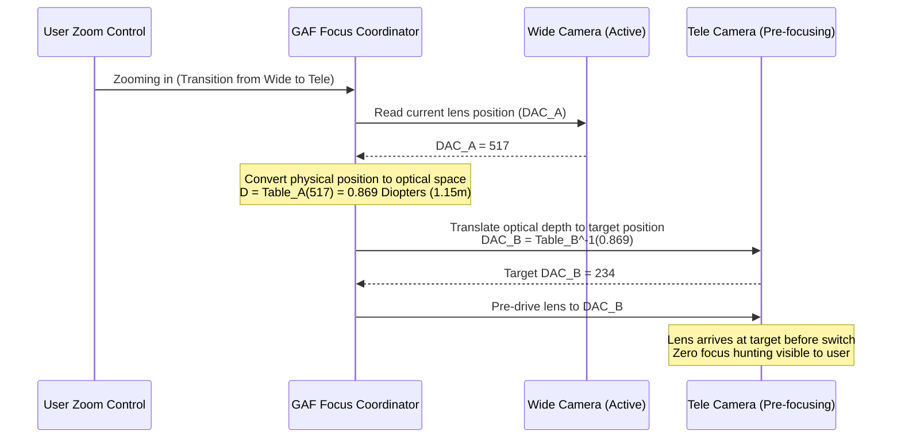

# Deep Dive: Diopter Table Design & Verification in Autofocus Systems

This document provides a rigorous, senior-level system analysis of **Diopter Table Design** in camera Auto Focus (AF) systems. It utilizes the *Scaling & Robustness Pyramid* framework to evaluate the mathematical foundation, boundary limits, algorithmic trade-offs, and system-level concurrency.

---

## The Core Concept: Why Diopter?

In mobile camera systems, the Auto Focus (AF) actuator (typically a Voice Coil Motor, or VCM) moves the lens group along the optical axis to adjust focus. 

*   **Lens Position (DAC):** The physical position is controlled by a digital-to-analog converter (DAC) that regulates the current passing through the VCM coil.
*   **Object Distance (Meters):** The physical distance from the camera to the target object.
*   **Diopter ($D$):** The reciprocal of the distance in meters:
    $$
    D = \frac{1}{d}
    $$

### The Linearity Advantage
If we plot **Lens Position (DAC)** against **Object Distance (Meters)**, the relationship is a highly non-linear hyperbola ($y \propto 1/x$). This makes control loops and interpolation extremely complex:

```
Distance Space (Non-linear):
Lens Position (DAC)
  ^
  |      *
  |       *
  |         *
  |            *
  |                  *
  +---------------------------> Object Distance (Meters)
```

However, if we map **Lens Position (DAC)** against **Diopter ($1/d$)**, the relationship is remarkably linear:

```
Diopter Space (Highly Linear):
Lens Position (DAC)
  ^
  |                  *
  |            *
  |      *
  |*
  +---------------------------> Diopter (1/Meters)
```

By working in **Diopter Space**, the camera HAL (Hardware Abstraction Layer) can perform simple linear interpolation, coordinate translations, and multi-sensor fusion (e.g., merging PDAF defocus signals with ToF range inputs).

---

## 1. Core Correctness & Mathematical Model

The relationship between the DAC value ($x$) and the Diopter ($y$) is represented inside the AF firmware/HAL as:
$$
y = f(x) \quad \text{or} \quad x = g(y)
$$

### Implementation Methods:
1.  **Piece-wise Linear Lookup Table (LUT):**
    *   A table of $N$ calibrated points: $(DAC_i, Diopter_i)$.
    *   For intermediate values, binary search is performed, followed by linear interpolation:
        $$
        y = y_1 + \frac{y_2 - y_1}{x_2 - x_1} \cdot (x - x_1)
        $$
2.  **Polynomial Curve Fitting:**
    *   Modeling the lens profile via a 3rd or 4th-degree polynomial:
        $$
        y = c_4 x^4 + c_3 x^3 + c_2 x^2 + c_1 x + c_0
        $$

---

## 2. Boundary Conditions & Edge Cases (What Could Go Wrong?)

Designing a robust diopter system requires defending against physical and algorithmic limits.

| Edge Case | Problem | Mitigation Strategy |
| :--- | :--- | :--- |
| **Out-of-Range Inputs (Clamping)** | Target object is closer than Macro limit (e.g. 5cm) or beyond Infinity. | **Clamping Logic:** Clamp output to physical limits (e.g., `clamping 1` in logs). Prevent the DAC from driving the VCM beyond its mechanical boundaries, which could cause hardware damage or coil overheating. |
| **VCM Hysteresis (滯後效應)** | Friction and spring memory cause the lens to stop at different positions depending on whether it moved from Near-to-Far or Far-to-Near. | **Directional Backlash Compensation:** Apply a software correction offset ($DAC_{offset}$) based on the movement direction. |
| **Gravity Tilt** | The weight of the lens group shifts the DAC-to-Diopter curve depending on the device orientation (pointing down, up, or flat). | **G-Sensor Compensation:** Read the accelerometer vector and shift the diopter table base dynamically: $DAC_{compensated} = DAC_{table} + DAC_{gravity}$. |
| **Thermal Drift** | Camera chassis and optical elements expand/contract with heat, shifting the infinity and macro focus planes. | **Lens Thermal Compensation (LTC)**: Shift the diopter curve horizontally or vertically using real-time temperature sensor telemetry. |

---

## 3. Algorithmic Trade-Offs (LUT vs. Polynomial)

A senior engineer must weigh the architectural pros and cons of how the diopter table is represented in memory:

```
+-------------------------------------------------------------------------+
|                              DESIGN DECISION                            |
+-------------------------------------------------------------------------+
                                     |
                  +------------------+------------------+
                  |                                     |
        [ Piece-wise LUT ]                     [ Polynomial Fitting ]
        - Time: O(log N) search                - Time: O(d) multiplications
        - Space: O(N) array storage            - Space: O(1) float storage
        - Pros: Zero fitting distortion        - Pros: Perfect smoothness
        - Cons: Discontinuous derivatives      - Cons: Runge's oscillation
```

### Piece-wise Lookup Table (LUT)
*   **Time Complexity:** $O(\log N)$ to find the matching interval using binary search, plus $O(1)$ interpolation.
*   **Space Complexity:** $O(N)$ memory to store the calibration arrays.
*   **Pros:** Fits arbitrary, complex physical curves exactly without mathematical modeling distortion.
*   **Cons:** First derivative (velocity of lens movement) is discontinuous at boundaries, which can cause jittery lens movements during active video tracking.

### Polynomial Fitting (e.g., 4th-degree)
*   **Time Complexity:** $O(d)$ operations (where $d$ is the degree) using Horner's Method:
    $$
    y = (((c_4 x + c_3)x + c_2)x + c_1)x + c_0
    $$
*   **Space Complexity:** $O(1)$ — only the $d+1$ float coefficients need to be stored.
*   **Pros:** Smooth, infinitely differentiable curve. Ensures smooth lens transitions.
*   **Cons:** Risk of Runge's Phenomenon (oscillations at the extreme ends of the interpolation range). High floating-point processing requirements if executed on low-power microcontrollers.

---

## 4. System-Level Scale & Concurrency (Multi-Cam Sync)

In modern multi-camera architectures (Wide + Tele + UltraWide), seamless zoom transition is a key user experience metric.



### System Latency & Concurrency Constraints:
1.  **Hard Real-time Deadline:** The diopter translation and pre-drive sequence must complete within the camera switch window (typically less than $30\text{ms}$ or 1 frame interval) to prevent visual stutter.
2.  **Thread Safety:** The Diopter Table configuration (.textproto config files) is loaded into shared memory. The focus coordinator must handle concurrent access:
    *   *Reader thread:* Active frame-processing loop checking PDAF defocus.
    *   *Writer thread:* Temperature monitoring thread applying LTC offsets to the base diopter table.
    *   *Solution:* Use read-copy-update (RCU) or thread-safe atomic offsets to prevent locking up the critical frame-processing pipeline.

---

## 5. Verification & Log-Analysis Strategy

Since you verified these mappings, you can explain how log parsing is used to debug diopter table failures:

1.  **Identify Discrepancy:**
    *   If multi-cam switch results in blur, look for mismatch in calculated diopter:
        `UtilLensPositionToDiopter: lens_position 517, diopter 0.869` vs. `GetEstimatedDistanceRangeDiopter: TOF distance 1199 mm (0.833 Diopter)`
    *   A delta greater than $0.05$ Diopter often indicates that the calibration table is outdated, or that gravity/thermal compensation failed to apply.
2.  **Verify Clamping Limits:**
    *   Check if `clamping 1` is logged under macro conditions. If clamping fails, VCM may hit mechanical stops, causing audio clicks in video recordings or sensor damage.
