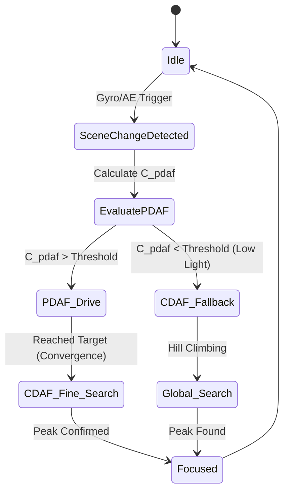

# Deep Dive: Hybrid AF (PDAF + CDAF) Fusion Strategy

This document provides a senior-level analysis of **Hybrid Auto Focus Architecture**, specifically focusing on the fusion of Phase Detection Auto Focus (PDAF) and Contrast Detection Auto Focus (CDAF). This is a critical component in modern smartphone cameras to achieve "Zero Shutter Lag" (ZSL) and robust focusing under extreme conditions.

---

## 1. The Core Problem: Why Hybrid?

Single-mode AF systems suffer from inherent physical limitations:

*   **PDAF (Phase Detection):** 
    *   *Pros:* Extremely fast (One-step calculation), directional (knows whether to move lens forward or backward).
    *   *Cons:* Fails in low-light (poor SNR), struggles with horizontal line patterns (if pixels are split left/right), and can be inaccurate for macro shots due to optical aberrations.
*   **CDAF (Contrast Detection):**
    *   *Pros:* Highly accurate, works well in low-light, unaffected by pattern orientation.
    *   *Cons:* Slow (requires iterative "Hill Climbing"), non-directional (must hunt to find the peak), and suffers from "overshoot" (must pass the peak to know it was the peak).

**The Hybrid Goal:** Utilize PDAF for high-speed, long-distance coarse movement, and seamlessly hand over to CDAF for micro-step fine-tuning, all while handling fallback scenarios gracefully.

---

## 2. Signal Processing & Confidence Metrics

A robust Hybrid AF system relies heavily on quantifying the reliability of the incoming signals.

### 2.1 PDAF Confidence Level ($C_{pdaf}$)
PDAF calculates the phase difference ($\Delta \phi$) between left and right pixels. The Confidence Level is calculated based on:
1.  **Cross-Correlation Peak:** How sharp the peak is when correlating the L and R signals.
2.  **Signal-to-Noise Ratio (SNR):** Evaluated against the current analog gain (ISO).
3.  **Defocus Amount:** Confidence drops when the image is severely blurred (large defocus).

### 2.2 Scene Brightness Value (BV)
Extracted from the Auto Exposure (AE) module. It dictates the noise floor.

---

## 3. The Fusion State Machine

The core of the Hybrid AF algorithm is a Finite State Machine (FSM) that dictates actuator behavior.

### 3.1 Phase 1: Coarse Search (PDAF Drive)
If $C_{pdaf} > \text{Threshold}$:
*   Calculate target DAC position.
*   Drive VCM at maximum safe velocity to target $\pm \delta$ (leaving a tiny margin to prevent mechanical overshoot).

### 3.2 Phase 2: Fine Search (CDAF Handover)
Once PDAF drive completes:
*   Switch to CDAF.
*   Take 2-3 micro-steps to calculate the Focus Value (FV) curve derivative.
*   Confirm the mathematical peak (using quadratic interpolation over 3 points for sub-step accuracy) and settle the lens.

---

## 4. Edge Cases & Defensive Programming

| Edge Case | Phenomenon | Algorithmic Solution |
| :--- | :--- | :--- |
| **Low-Light / Flat Wall** | PDAF returns random noisy values; CDAF FV curve is flat. | **Noise Floor Gating:** If max FV amplitude < Noise Floor, halt lens movement (Early Stop). Maintain hyperfocal distance to prevent continuous hunting (拉風箱). |
| **Repetitive Patterns (柵欄效應)** | PDAF cross-correlation produces multiple false peaks. | **Spatial Frequency Analysis:** Use CDAF to detect multi-peak curves. Restrict PDAF search range and enforce a full CDAF sweep if a repetitive pattern is detected. |
| **Moving Objects** | Object moves during the CDAF fine search, causing the peak to shift. | **Predictive Tracking (Kalman Filter):** Feed PDAF phase velocity $\frac{d(\Delta \phi)}{dt}$ into a Kalman filter to predict the next required lens position, bypassing CDAF entirely during continuous motion. |

---

## 5. System-Level Optimization (C++ / RTOS)

To meet the strict $33\text{ms}$ (at 30fps) frame deadline, the algorithm must be optimized:

1.  **Hardware ISP Offloading:** Do not calculate Contrast FV in software (CPU). Configure the hardware Image Signal Processor (ISP) to output FV statistics directly to a memory-mapped register.
2.  **Fixed-Point Math:** Replace floating-point L/R cross-correlation with fixed-point SIMD (NEON) instructions.
3.  **Pipeline Synchronization:** 
    *   *Frame N:* Expose & Readout.
    *   *Frame N+1:* Calculate PDAF/CDAF, output target DAC.
    *   *Frame N+2:* I2C write to VCM driver.
    *   **Challenge:** The algorithm must compensate for the 2-frame latency pipeline to prevent control loop oscillation.
