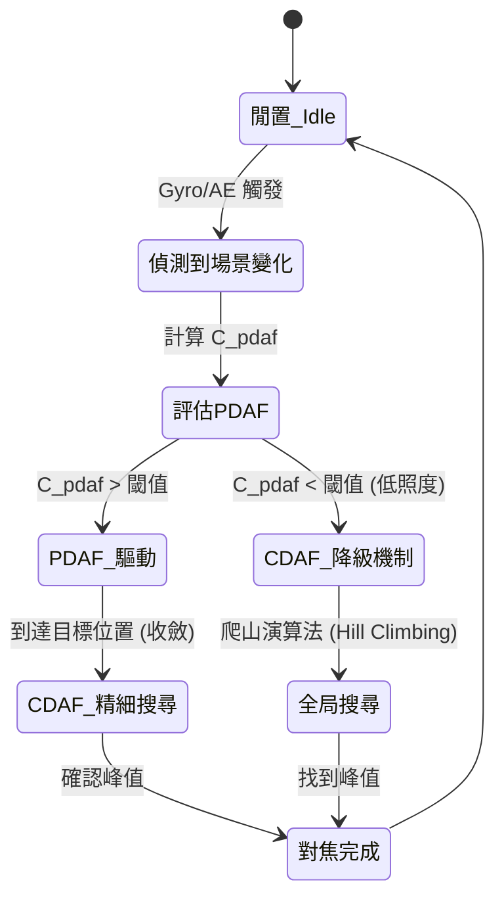

# 深度解析：混合自動對焦 (Hybrid AF) 融合策略

本文件以資深工程師的系統級視角，深入探討**混合自動對焦架構 (Hybrid AF Architecture)**，特別聚焦於**相位對焦 (PDAF)** 與 **反差對焦 (CDAF)** 的融合演算法。這是現代智慧型手機相機實現「零延遲快門 (ZSL)」並在極端場景下保持穩定對焦的核心技術。

---

## 1. 核心痛點：為什麼需要混合對焦 (Hybrid AF)？

單一模式的 AF 系統存在難以克服的物理限制：

*   **PDAF (相位對焦):** 
    *   *優點:* 速度極快 (一步到位)，具備方向性 (知道鏡頭該往前還是往後推)。
    *   *缺點:* 在低照度下失效 (訊噪比極差)，對特定紋理 (如水平線條) 對焦困難，且在微距場景下受光學像差影響容易不準確。
*   **CDAF (反差對焦):**
    *   *優點:* 準確度極高，低照度下仍能運作，不受物體紋理方向影響。
    *   *缺點:* 速度慢 (需要反覆「爬山」搜尋)，不具備方向性 (必須前後推動才知道方向)，且有「過衝 (Overshoot)」問題 (必須越過最高點才知道最高點在哪)。

**混合對焦的目標：** 利用 PDAF 進行高速、長距離的粗調 (Coarse movement)，接著無縫交接給 CDAF 進行微步距的精調 (Fine-tuning)，同時優雅地處理各種退化 (Fallback) 場景。

---

## 2. 訊號處理與信心度指標 (Confidence Metrics)

穩健的混合對焦系統高度依賴對輸入訊號可靠度的量化評估。

### 2.1 PDAF 信心度 (C_pdaf)
PDAF 計算左右像素的相位差 (Delta_phi)。其信心度主要基於以下因素：
1.  **互相關峰值銳利度 (Cross-Correlation Peak):** 左右訊號進行互相關計算時，峰值是否足夠尖銳。
2.  **訊噪比 (SNR):** 根據當前的類比增益 (ISO 值) 進行動態評估。
3.  **失焦量 (Defocus Amount):** 當影像極度模糊時，相位差計算的信心度會大幅下降。

### 2.2 場景亮度值 (Brightness Value, BV)
從自動曝光 (AE) 模組提取，用於決定系統的雜訊基準 (Noise Floor)。

---

## 3. 融合狀態機 (Fusion State Machine)

混合對焦演算法的核心是一個控制馬達行為的**有限狀態機 (FSM)**。

### 3.1 第一階段：粗略搜尋 (PDAF 驅動)
若 C_pdaf > Threshold：
*   計算目標 DAC 位置。
*   以最大安全速度將 VCM 馬達推動至目標位置 +/- delta（保留微小餘裕以防止機械結構過衝）。

### 3.2 第二階段：精細搜尋 (CDAF 交接)
當 PDAF 驅動完成後：
*   切換至 CDAF。
*   進行 2-3 個微步距移動，計算對焦值 (FV) 曲線的導數。
*   確認數學峰值（使用 3 點進行二次插值以達到亞步距精度）並穩定鏡頭。

---

## 4. 邊緣場景與防禦性編程 (Edge Cases)

| 邊緣場景 | 現象 | 演算法解決方案 |
| :--- | :--- | :--- |
| **低照度 / 平坦白牆** | PDAF 輸出雜訊；CDAF FV 曲線平坦。 | **雜訊門檻阻斷 (Noise Floor Gating):** 若最大 FV 振幅小於系統雜訊基準，則停止鏡頭移動 (Early Stop)，保持在泛焦距離 (Hyperfocal distance)，防止拉風箱。 |
| **重複性紋理 (柵欄效應)** | PDAF 互相關計算產生多個假峰值。 | **空間頻率分析:** 利用 CDAF 偵測多峰曲線。一旦偵測到重複性圖案，限制 PDAF 搜尋範圍，並強制進行 CDAF 全局掃描。 |
| **移動物體** | 物體在 CDAF 精細搜尋時移動，導致峰值偏移。 | **預測追蹤 (Kalman Filter):** 將 PDAF 的相位速度 d(Delta_phi)/dt 丟入卡爾曼濾波器，預測下一個所需的鏡頭位置，在連續移動狀態下完全跳過 CDAF。 |

---

## 5. 系統級優化 (C++ / RTOS)

為滿足嚴格的 $33\text{ms}$ (於 30fps) 幀處理期限，演算法必須進行極致優化：

1.  **硬體 ISP 加速:** 不要在軟體 (CPU) 中計算 Contrast FV。配置硬體的影像訊號處理器 (ISP)，將 FV 統計資料直接輸出至記憶體映射暫存器 (Memory-mapped register)。
2.  **定點數運算 (Fixed-Point Math):** 使用 SIMD (NEON) 指令集，將浮點數的 L/R 互相關計算替換為定點數運算。
3.  **Pipeline 同步問題:** 
    *   *Frame N:* 曝光與讀取。
    *   *Frame N+1:* 計算 PDAF/CDAF，輸出目標 DAC。
    *   *Frame N+2:* 透過 I2C 寫入 VCM 驅動晶片。
    *   **挑戰:** 演算法必須提前補償這 2 幀的 Pipeline 延遲，以防止控制迴路產生震盪。
