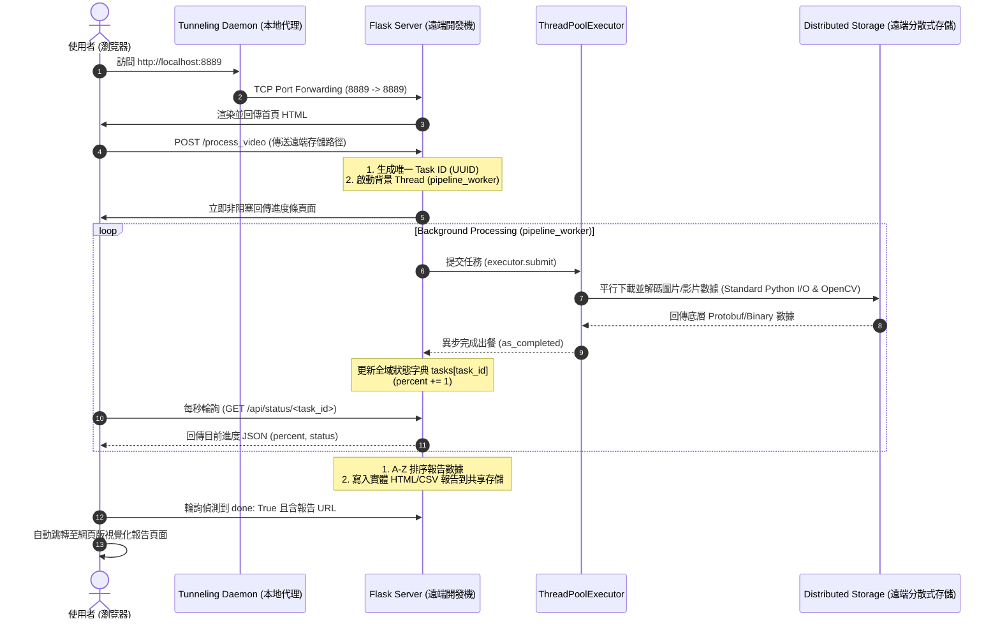

# 影像比對解析專案 技術面試準備指南 (De-confidentialized)

本指南旨在幫助您在軟體工程師 (SWE/SRE/Backend) 面試中，將此影像解析專案包裝為一個高價值、不涉及特定公司機密的代表作。所有內部專有名詞已替換為**行業標準術語**。

---

## 1. 專案一分鐘閃電介紹 (Elevator Pitch)

> 「我為相機演算法開發團隊設計並實作了一套**高效能的多媒體數據平行解析平台與實時除錯系統**。
>
> **痛點**：過去工程師在比對影像對焦演算法數據時，需要手動從遠端分散式網絡存儲下載海量的照片與影片，並手動使用解碼器解析內嵌的二進位 Metadata，除錯流程極度耗時。
>
> **解決方案**：我使用 **Flask** 架構了異步工作調度伺服器，並基於 **Python 多執行緒 (ThreadPoolExecutor)** 實作了平行解析引擎。整個系統能在數秒內，將遠端共享資料夾內所有影片/相片之底層演算法對焦狀態、ROI（興趣區域）座標、時戳等 Protobuf 資訊提取出來，並自動生成具備 A-Z 字母排序、雙影片同步播放對照的視覺化 HTML/CSV 報告。
>
> **成果**：將團隊除錯與比對報告的產出時間從數十分鐘縮短至**數秒鐘**，極大地提升了演算法調校的開發效率與開發者體驗 (DX)。」

---

## 2. 系統架構與端到端資料流 (Architecture & Data Flow)



---

## 3. 三大核心技術亮點 (Technical Highlights)

### 亮點一：I/O Concurrency & GIL Tuning (I/O 平行與 GIL 調校)
*   **技術實現**：在 8 核的 CPU 上設定 `max_workers = 12` 的 `ThreadPoolExecutor`。
*   **理論支撐**：在 CPython 架構下，執行緒遇到 I/O 操作（如網路硬碟讀寫、等待網路響應）時會自動釋放 GIL。因此，可以使用超過物理核心數的 Threads 進行執行緒超載 (Oversubscription)，確保 CPU 核心在等待網絡 I/O 的空檔中，能被最大化地利用來執行解碼運算。

### 亮點二：O(1) Completion-order Progress Reporting (非阻塞事件驅動回收)
*   **技術實現**：
    ```python
    future_to_image = {executor.submit(...): image_path for image_path in list}
    for future in as_completed(future_to_image):
        image_path = future_to_image[future]
    ```
*   **理論支撐**：採用反向映射哈希表 (`Future -> Path`)。當 `as_completed` 返回先完成的任務時，我們能以 **$O(1)$ 常數時間** 反查出是哪一張影像完成，這完全破除了**線頭阻塞 (Head-of-Line Blocking)**，讓進度條得以便捷、順暢地實時更新。

### 亮點三：Defensive Programming & Resilience (防禦性編程與系統容錯)
*   **路徑自愈**：後端接口能自動偵測、容錯並修補使用者輸入的相對路徑與前綴缺失。
*   **狀態隔離**：在背景 Worker 啟動前，在主 Thread 預先初始化全域 Task 字典，杜絕前端高頻輪詢時可能造成的 `KeyError` 競態條件。
*   **優雅降級**：在將數據導出報告前，使用標準 I/O API 校對檔案存在性，防止因實體檔案遺失導致的前端破圖或後端崩潰。

---

## 4. 預測面試官的 Follow-up 追問與完美回答 (Q&A)

### Q1: Python 的全域字典 `tasks` 在多執行緒環境下讀寫，是 Thread-safe (執行緒安全) 的嗎？你需要加鎖 (Lock) 嗎？
> **完美回答**：
> 「在 CPython 中，由於 GIL 的存在，基本的操作（如字典的單純寫入 `d[k] = v` 或讀取）是原子性 (Atomic) 的。
>
> 然而，如果是『讀取再寫入 (Read-Modify-Write)』的非原子操作（例如自增 `tasks[id]['percent'] += 1`），在極端併發下仍有可能發生競態條件。在本專案中，因為**每一個 Task 都有唯一的 UUID**，且背景 Worker 只會修改其專屬的 `task_id` 空間，而主伺服器只會進行唯讀 (Read-only) 的輪詢，因此沒有多個執行緒同時寫入同一個 Key 的問題。
>
> 如果未來系統需要擴展，我會引入 `threading.Lock` 或是改用執行緒安全的 `queue.Queue` 來進行狀態傳遞，以確保絕對的並行安全。」

### Q2: 既然 Python 存在 GIL，你為什麼不直接使用 `ProcessPoolExecutor` (多行程) 來達到真正的多核並行？
> **完美回答**：
> 「這取決於**任務的瓶頸在哪裡**。
>
> 1. **記憶體與開銷**：`Multiprocessing` 需要 Fork 獨立的子行程，這在記憶體中會複製父行程的資源。因為我們的 Pipeline 需要加載多個解碼器與 OpenCV 影像庫，子行程的啟動與記憶體開銷非常巨大。
> 2. **IPC 開銷**：多行程間的資料通訊需要進行序列化與反序列化 (Pickling)，這在傳遞大量的影像二進位數據時會產生昂貴的 CPU 開銷。
> 3. **I/O 優先**：我們的瓶頸是等待遠端共享存儲的網絡 I/O，使用輕量級的 Thread 配合 `as_completed` 已經能將等待時間重疊，並釋放 GIL。因此使用 `ThreadPoolExecutor` 是在效能、記憶體開銷與程式碼複雜度三者之間最平衡的架構抉擇。」

### Q3: 目前的 `tasks` 字典存在 Server 記憶體內。如果 Server 當機重啟，進度就會全部丟失。如果全團隊 100 人同時使用，你該如何將架構升級？
> **完美回答**：
> 「這是一個典型的**無狀態伺服器 (Stateless Server) 與分散式調度**的架構升級問題。我會做以下三點改進：
>
> 1. **引入狀態快取層 (Cache Layer)**：將 `tasks` 字典移出 Flask 記憶體，改用 **Redis** 作為分散式狀態儲存。Redis 支持極高的讀寫併發，且具備資料持久化功能。
> 2. **引入分散式任務佇列 (Message Queue)**：使用 **Celery** 搭配 Redis，將 Flask 伺服器與背景 Worker 完全解耦。Flask 只負責接收請求並寫入任務至 Redis，多台獨立的 Worker 機器再去認領任務執行。
> 3. **負載平衡 (Load Balancing)**：將 Flask 伺服器部署多台，前面掛載負載均衡器進行分流。因為狀態都在 Redis 中，任何一台伺服器當機都不會影響使用者輪詢進度。」

### Q4: 使用者在網頁輸入資料夾路徑。如果有人蓄意輸入 `../../etc/passwd`，這會造成路徑穿越攻擊 (Path Traversal)。你該如何進行安全防禦？
> **完美回答**：
> 「這涉及 Web 安全防禦。在生產環境中，我會採取以下防禦手段：
>
> 1. **嚴格的前綴白名單 (Prefix Whitelisting)**：我們會實作路徑補全。我會強制校驗路徑必須以遠端安全掛載路徑（例如 `/mnt/shared/assets/`）作為起始前綴，不在此白名單內的路徑一律拒絕。
> 2. **路徑正規化校驗 (Path Normalization Check)**：使用 Python `os.path.abspath()` 或是 `pathlib.Path.resolve()` 將路徑解析為絕對路徑，並寫入防禦邏輯：
>    ```python
>    resolved_path = Path(user_input).resolve()
>    if not resolved_path.startswith(WHITELIST_ROOT):
>        raise PermissionError("Access Denied")
>    ```
>    這能徹底防止透過 `..` 回退到根目錄的攻擊手法。」

### Q5: 你如何針對這個高度依賴遠端檔案系統與底層二進位解碼模組的 Pipeline 撰寫單元測試 (Unit Test)？
> **完美回答**：
> 「我們會採用 **Mocking (模擬環境)** 的測試策略，避免單元測試依賴實體網絡與硬體：
>
> 1. **Mock 檔案系統 (File System Mocking)**：使用 `unittest.mock` 去 Mock Python 標準 I/O 函式（如 `os.walk`、`open` 與 `exists`）。我們不需要真的去讀存儲，而是讓 Mock 函式模擬回傳一個假的檔案列表與測試二進位數據。
> 2. **Mock 解碼器 (Decoder Mocking)**：將解析內部資料調用二進位解碼器的部分進行 Mock，直接回傳預設的資料字典結構，從而聚焦於測試 Pipeline 的邏輯（例如進度計算、排序與 HTML 報告生成）。
> 3. **測試併發**：透過 Mock 模擬不同 Threads 的回傳延遲，驗證 `as_completed` 是否能正確依據完成順序回收資料，且沒有發生 Race Condition。」
